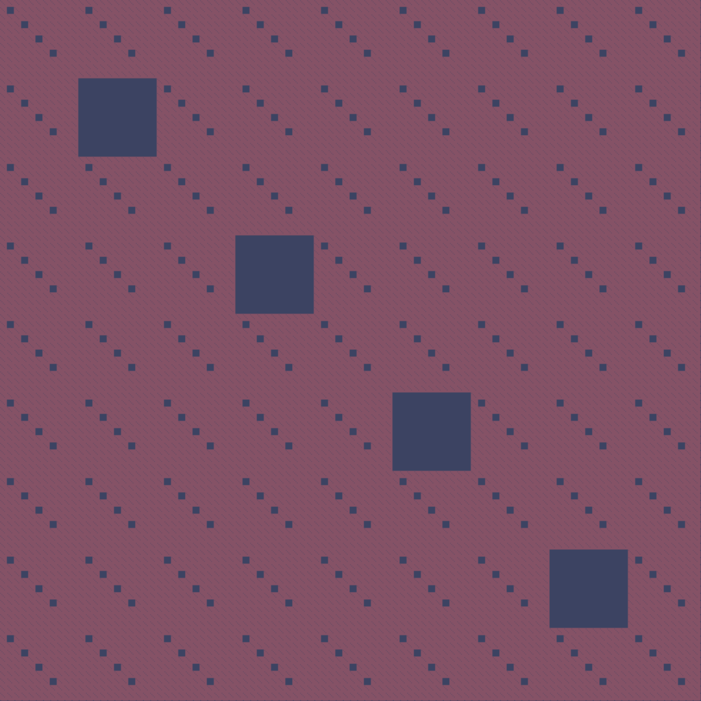

# Sierpinski Carpet Generator
> Create beautiful Sierpinski Carpets fractals with the help of this tool.

[Website](https://carpet.nikcodes.xyz/)

### What is a Sierpinski Carpet?
The Sierpiński carpet is a plane fractal first described by Wacław Sierpiński in 1916. The carpet is a generalization of the Cantor set to two dimensions.

### How to use the tool
You can download the code and serve the content of the folder **"carpet"** in an HTTP server, or you can use the [website](https://carpet.nikcodes.xyz/).

Once inside the app, you can open the developer console (ctrl + shift + k) and let your imagination run free.

### App features
- A Sierpinski Carpet size of 1080x1080.
- Record and download the carpet creation.
- 2 methods of carpet creation (sequential or random).
- Multiple color pallets (8 different color pallets, you can add your own).
